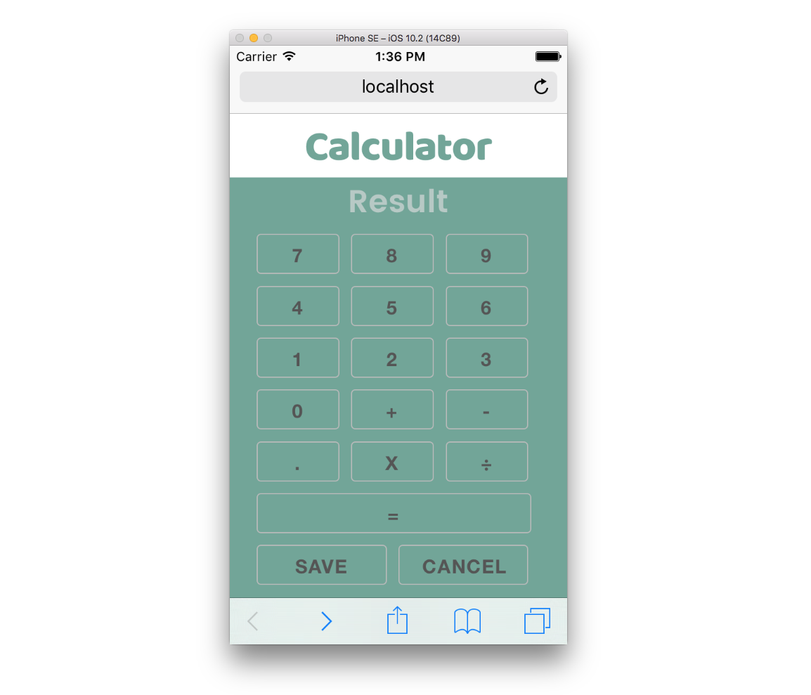

This Project was built for a code test.

### See the working example here [link](http:) 

##### Task
- Build a calculator where you can save your maths.
- Minimum browser requirement is Chrome.
- The calculator should fit within the size of the viewport for Mobile and Tablet.
- Use of pre-processor for Javascript and CSS is very welcome but not essential
- Unit-Testing is an added value.
- The technology stack is at your complete discretion.
- Provide clear and valid motivations about your decisions over frameworks (if any) and patterns.
- Use the wireframes provided.

##### Behaviours
*Result*: Should display the current math
*SAVE*: Press to save your current math into *Saved Maths*. When pressed, the user will be
prompt to submit a name
*CANCEL*: Press to reset Result
*Saved Maths*: List of selectable maths. Maths should be ordered by date and time
*Math Name/Date*: Press to display the selected math in Result
*DELETE*: Remove a saved Math Name/Date from Saved Maths

##### My result
Using JavaScript I created an Express Node app. Gulp tasks made the use of SASS and development easier. To make the responsive nature of the design easier I used a front-end framework called Skeleton. Sorting of the list was achieved by using the Tinysort library, a task that given the potential complexity could have taken a fair bit of vanilla JavaScript.

HTML has been checked to be valid with https://validator.w3.org.

##### Future development

- Add unit testing with a Mocha and Chai
- Add in Babel into the gulp tasks and refactor the main.js file into JavaScript ES6

##### To run this code yourself...
- Clone this repo
- Run `npm i` to install the packages
- Run `gulp`
- Go to http://localhost:8000 in your browser of choice.